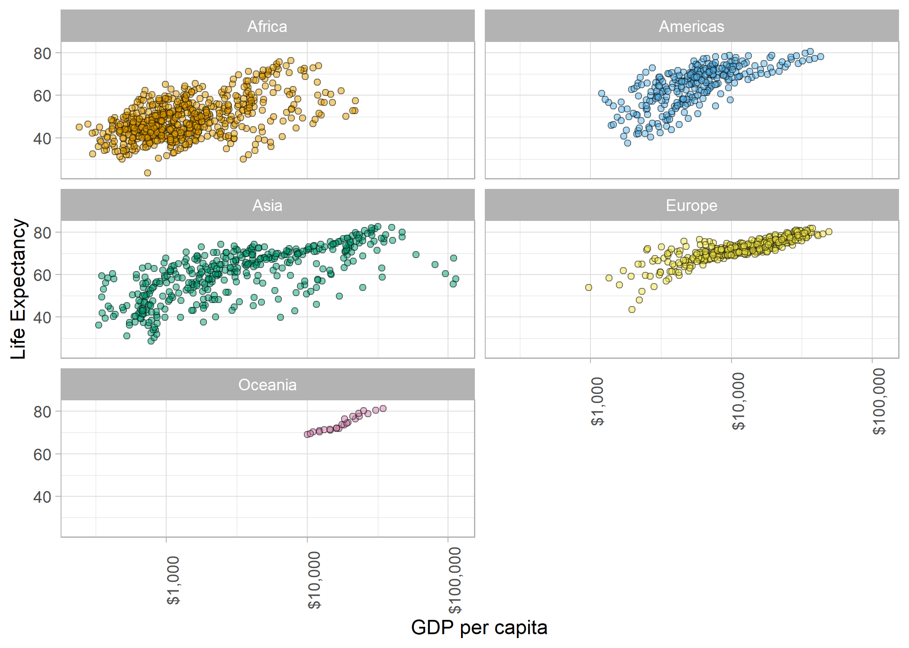

## Assignment Objective

The aim of this homework assignment is to improve understanding of data portability with the goal of improving skills for collaborative data analysis, data sharing and results visualization.


This assignment includes:

* Write data to file and load it back into R
* Explain the value of the here::here package
* Improve a figure (or make one from scratch), using new knowledge, e.g., control the color scheme, use factor levels, smoother mechanics.
* Reorder a factor in a principled way based on the data and demonstrate the effect in arranged data and in figures.
* Implement visualization design principles.


```{r setup, include = FALSE}
knitr::opts_chunk$set(echo = TRUE, warning = FALSE, fig.align = "center")
```

```{r packages, warning = FALSE, message = FALSE}
library(tidyverse)
library(gapminder)
library(forcats)  # factors
library(here)     # practical directory navigation & file management 
library(readr)    # read in delimited files

library(knitr)    # for tidy tables
library(DT)       # for datatable in html
```

# Exercise 1: Explain the value of the here::here package 

__Task: In your own words, summarize the value of the here::here package in 250 words or fewer.__

Data management and reproducible workflow are easier with ```here::here()```, which locates directory files without specifying file-paths and works across operating systems and platforms.
```getwd()``` returns an absolute file-path to the working directory and if _.R_ and _.Rmd_ files exist in one folder, then ```here()``` and ```getwd()``` return the same result. 

 ```
 # circumstantially equivalent:
here::here()
base::getwd()
```

And a file can be saved like this:

```
write.csv(paste0(base::getwd(), "/file-name.csv")
```
However, R identifies the root directory of _.R_ and _.Rmd_ files differently: ```here()``` and ```getwd()``` will return different results for a .Rmd file in a sub-folder. By default, R recognizes the folder containing .Rproj as the working-directory for _.R_ files; and the folder containing .Rmd as the working-directory for .Rmd files. Directory path recognition matters for reading and writing files (i.e. input/output).
Storing all files associated with a project in a single folder could eliminate directory confusion, but generally it’s better to organize files in sub-folders. In base-R, file input/output to sub-folders requires manually specifying an absolute file-path, which is not good practice because a path is unique to each device/platform.
```here::here()``` follows logical steps to detect the main project folder (root directory, ‘here’) and sub-folders are accessed with arguments for path components:

  ```
# read input data
read.csv(here("sub-folder", "file-name.csv"))
```

```here::here()```defines file paths relative to the top level of an RProject file (the main project folder), meaning input/output files remain organized. Research data management can become overwhelming; any tool that reduced file-anxiety and streamlines R-workflow is a tool worth using.


# Exercise 2: Factor management

## 2-A: Drop Oceania

Filter the gapminder dataset to remove observations associated with Oceania.

```{r E2 filter factor}
# check structure of the gapminder data set
str(gapminder)
# the variables country and continent are factors

# observations for each continent
gapminder %>% 
  count(continent)

# plot it:
gapminder %>%
  ggplot() +
  geom_bar(aes(continent, fill = continent)) +
  theme_light() +
  ylab("Number of Observations") + xlab("")


# drop observations associated with Oceania
no_OCN <- gapminder %>% 
  filter(continent != "Oceania") 

# check the data
no_OCN %>% 
  summary()

no_OCN %>% 
  count(continent)

# plot it:
no_OCN %>%
  ggplot() +
  geom_bar(aes(continent, fill = continent)) +
  theme_light() +
  ylab("Number of Observations") + xlab("")

# --- BUT
# check the structure:
no_OCN %>% 
  str()

# the level "Oceania" still exists, it's just empty.
levels(no_OCN$continent)
```

There are no no observations for the continent Oceania. However, the factor level still exists in the dataset (though it is empty). Now, remove the empty level entirely.

```{r droplevels}
# use base::droplevels() to remove the empty Oceania level
no_OCN2 <- base::droplevels(gapminder$continent, exclude = "Oceania") 

# check the data
no_OCN2 %>% 
  levels()

no_OCN %>% 
  count(continent)
```

Now, the Oceania level has been removed from the factor 'continent'. 

## 2-B: Re-order levels

Use the 'forcats' package to reorder the levels of country or continent based on summarized information of one of the quantitative variables. Consider experimenting with a summary statistic beyond the most basic choice of the mean/median. Use the forcats package in the tidyverse for this, rather than the base R function as.factor.

```{r reorder1}
# use forcats::fct_reorder() based on median GDP/capita
gapminder %>% 
  ggplot() + 
  geom_bar(aes(fct_reorder(continent, gdpPercap, median), fill = continent)) +
  theme_light() +
  labs(y = "Number of Observations", 
       x = "", 
       caption = "Continents ordered by median GDP/capita (lowest to highest, left to right)")

```

```{r reorder2}
# use forcats::fct_reorder() based on min life expectancy
gapminder %>% 
  ggplot() + 
  geom_bar(aes(fct_reorder(continent, lifeExp, max), fill = continent)) +
  theme_light() +
  labs(y = "Number of Observations", 
       x = "", 
       caption = "Continents ordered by maximum life expectancy (lowest to highest maximums read left to right)")

```

# Exercise 3: File input/output (I/O) 

## 3-A

Create something new from the gapminder dataset, export it to disk and then reload it back in using one of the packages above using here::here() whenever applicable.

```{r output}
# using gapminder, summarize gdpPercap mean, relative standard deviation, mode, min and max
# save a csv
gapminder %>% 
  group_by(continent) %>% 
  summarize(mean_gdp = mean(gdpPercap),
            sd_gdp = sd(gdpPercap),
            rsd_gdp = (sd(gdpPercap) / mean_gdp) * 100, # RSD = SD relative to mean 
            min_gdp = min(gdpPercap),
            med_gdp = median(gdpPercap),
            max_gdp = max(gdpPercap)) %>% 
  write.csv(here::here("hw05", "gapminder_GDPsummary.csv"))
```

The above code chunk created a summary table of GDP per capita for each of the five continents in the gapminder dataset, and saved the result as a .csv file in hw05-folder. 
Now, load that file back into this R session.

```{r input}
# read the csv file saved in the preceding chunk
(GDP_df <- read.csv(here::here("hw05", "gapminder_GDPsummary.csv")))
```

The dataset survived the output/input process. The only change appears to be the addition of a new column (column 1) which contains row numbers.

```{r}
# looks good!
# make it look nicer 
GDP_df %>% 
  select(-X) %>% # drop the first column that is just row numbers
  kable(digits = 0, 
        caption = "Table 1 (E3): GDP per capita by continent (in $USD)",
        col.names = c("continent", 
                      "Mean GDP ($)", 
                      "SD (± $)", 
                      "RSD (± %)", 
                      "Minimum ($)", 
                      "Median ($)", 
                      "Maximum ($)"))
```

## 3-B

With the imported data, play around with factor levels and use factors to order your data with one of your factors (i.e. non-alphabetically). For the I/O method(s) you chose, comment on whether or not your newly created file survived the round trip of writing to file then reading back in.

Assign categorical descriptions to the new dataset ```GDP_df```.

```{r new factor}
GDP_df %>% 
  select(-X) %>%
  mutate(national_wealth = as_factor(case_when(med_gdp < 2000 ~ "very low",
                                     med_gdp < 5000 ~ "low",
                                     med_gdp < 8000 ~ "medium",
                                     med_gdp < 11000 ~ "high",
                                     TRUE ~ "very high"))) %>% 
  arrange(med_gdp) %>% 
  kable(digits = 0, 
        caption = "Table 2 (E3): Categorized GDP per capita by continent (in $USD)",
        col.names = c("continent", 
                      "Mean GDP ($)", 
                      "SD (± $)", 
                      "RSD (± %)", 
                      "Minimum ($)", 
                      "Median ($)", 
                      "Maximum ($)",
                      "National Wealth"))
```

This was effective in adding a new factor variable to classify "national wealth" based on median GDP/capita. However, this summary ```GDP_df``` is too short to plot. If I had created a 'wealth' variable in the original dataset, it would be easier to plot. 


# Exercise 4: Visualization design 

_Recreate at least one figure in light of something you learned in the recent class meetings about visualization design and color, and create a side-by-side plot and juxtapose your first attempt (show the original figure as-is) with a revised attempt after some time spent working on it and implementing principles of effective plotting principles. Comment and reflect on the differences._

This is code from my hw01 exercise 3 (I removed text to make it brief).

```{r hw01-E3}
# subset the gapminder data for Canada
Canada_df <- gapminder[gapminder$country == "Canada", ]

# use base R to plot Canadian life expectancy over time
plot(y = Canada_df$lifeExp, x = Canada_df$year,
     ylab = "life expectancy (yrs)", xlab = "Year",
     type = "b",
     sub = "Life expectancy in Canada has steadily increased over time from 1952-2007.")

# use base R to plot global life expectancy with GDP
plot(y = gapminder$lifeExp, x = gapminder$gdpPercap,
     ylab = "life expectancy (yrs)", xlab = "GDP percapita")
```

These plots were good first attempts and I was very happy with them when I made them in week 2 of STAT 545. Now, I will improve them using tidyverse, ggplot2, and new knowledge of effective plotting principles. Each new plot is saved as an object to plot next to the original

```{r replot1}
# first, the plot of Canada's life expectancy over time and save it as a new object
(
new_plot1 <- gapminder %>% 
  filter(country == "Canada") %>% 
  ggplot(aes(x = year, y = lifeExp)) +
  geom_smooth(method = "lm", colour = "#009E73") +
  geom_point(shape = 21, size = 3.5, colour = "#000000", fill = "#E69F00") +
  theme_bw() +
  labs(y = "Life Expectancy", 
       x = "",
       caption = "Canadian life expectancy over time (source: 'gapminder')")
)
```

Now, I would like to plot the original and updated versions side by side, but it's tricky because the first plot was made in base R and the second in ggplot2. However, I found a way to do this on [stack overflow](https://stackoverflow.com/questions/14124373/combine-base-and-ggplot-graphics-in-r-figure-window).
This uses the package 'gridBase' and 'grid'.

```
install.packages("gridBase")
install.packages("grid")
```

```{r compare1}
library(gridBase)
library(grid)

par(mfrow=c(1, 2))  # set up one row by two columns
# plot original graph:
plot(y = Canada_df$lifeExp, x = Canada_df$year,
     ylab = "life expectancy (yrs)", xlab = "Year",
     type = "b",
     sub = "Life expectancy in Canada has steadily increased over time from 1952-2007.")
# this is from stackoverflow
plot.new()              
vps <- baseViewports()
pushViewport(vps$figure) 
vp1 <-plotViewport(c(1.8,1,0,1)) # margins: bottom, left, top, right
# ---
print(new_plot1, vp = vp1)
```

Now, do a similar improvement for the second plot from hw01-E3.

```{r replot2}
# re-plot in ggplot2 and save it as a new object
(
new_plot2 <- gapminder %>%
  ggplot(aes(x = gdpPercap, y = lifeExp, fill = continent)) + 
  geom_jitter(shape = 21, alpha = 0.5) +
  scale_fill_manual(values = c("#E69F00", "#56B4E9", "#009E73", "#F0E442", "#CC79A7")) + 
  scale_x_log10("GDP per capita", labels = scales::dollar_format()) + 
  theme_light() +
  labs(y = "Life Expectancy") +
  facet_wrap(~continent, ncol = 2, nrow = 3) +
  theme(legend.position = "none",  # hide the legend
        axis.text.x = element_text(angle = 90))  # rotate tick labels for clarity
)
```

Now, plot the original next to the updated version.

```{r side-by-side 2}
# print side-by-side
par(mfrow=c(1, 2))  
# original plot
plot(y = gapminder$lifeExp, x = gapminder$gdpPercap,
     ylab = "life expectancy (yrs)", xlab = "GDP percapita")
# side-by-side setup
plot.new()              
vps <- baseViewports()
pushViewport(vps$figure) 
vp1 <-plotViewport(c(1.8, 0.5, 0, 0.5)) # margins: bottom, left, top, right 
# ---
print(new_plot2, vp = vp1)
```

ggplot2 provides a legible way of plotting multiple factor levels, and specifying colours nicely. There seems to be more flexibility in ggplot2 than in base R graphics, and I find the code is much easier to read for a ggplot than a plot. Also, I don't think you can save a base-R plot as an object, whereas you can save a ggplot.

# Exercise 5: Writing figures to file 

## 5-A

Task: Use ggsave() to explicitly save a plot to file. Include the exported plot as part of your repository and assignment.

Save the new plots that were generated in Exercise 4. Note that you can specify ```plot = object```, if you do not specify an object for 'plot', ggsave will default to ```plot = last_plot()``` and save the last plot that was displayed (so, it's probably best to specify the plot you want).
Note also, ggsave() defalts to a 7 x 5 image, which is pretty big. Scale the size back a bit.
```{r}
# first plot
ggsave(filename = "ggplot_Cnd-LifeExp.png", 
       plot = new_plot1, 
       path = here::here("hw05"))

#       width = 5, height = 3)

# second plot
ggsave(filename = "ggplot_gdp-VS-lifeExp.png", 
       plot = new_plot2, 
       path = here::here("hw05"))
      # width = 5, height = 3)
```

# 5-B

Now, use `````` to load and embed that file into this report. 

Here is an updated version of the first plot I made in hw01 (exercise 3).
 


And here is an updated version of the second plot I made in hw01 (exercise 3).
 
